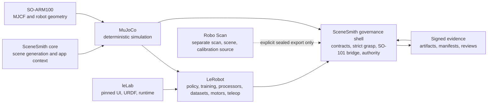
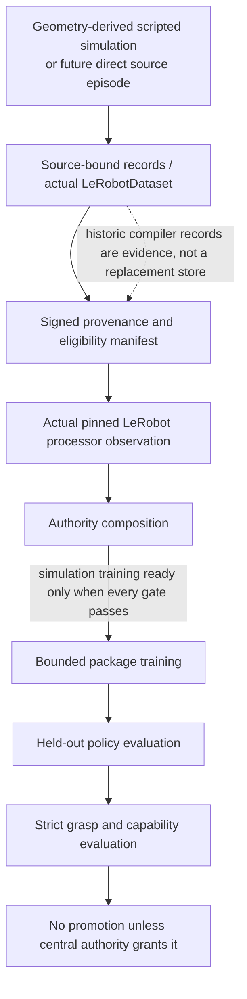
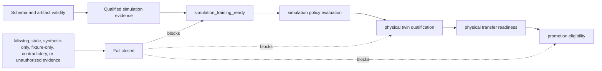

# SceneSmith SO-101 Program Architecture

## Purpose

The active program develops and evaluates SO-101 grasp behavior in MuJoCo while
keeping dataset provenance, training authority, strict contact semantics, and
physical-transfer claims separate. It is not a reimplementation of LeRobot.

The system is intentionally shaped as **pinned package capabilities plus a thin
SceneSmith governance shell**. That boundary is the key architectural choice:
packages execute ML, robot, dataset, teleoperation, and processor behavior;
SceneSmith proves what inputs, outputs, and claims are trustworthy.

The MVP is organized into five planes:

| Plane | Owns now | Important separation |
| --- | --- | --- |
| Representation | workcell/twin revisions, coordinates, geometry, explicit uncertainty | a twin candidate is not a qualified physical twin |
| Experimentation | tasks, state forks, episodes, perturbations, declared cousins | an episode is evidence for a named hypothesis, not merely a trajectory |
| Learning | pinned LeRobot policy adaptation and checkpoint evaluation | policy updates are distinct from twin calibration and optional dynamics learning |
| Runtime | MuJoCo execution now; separately permitted hardware execution later | the LLM/goal loop never becomes the real-time safety controller |
| Governance | content identity, observer roles, gates, certificates, lineage, rollback | component evidence cannot self-promote to a system-level state |

The current implementation keeps three mutable learning surfaces conceptually
separate: the workcell twin, the robot policy, and an optional learned dynamics
model. The MVP updates the policy and may compare a small explicit twin
ensemble. Learned world models and residual dynamics are intentionally cut.

## Component Map

| Component | Owns | Does not own |
| --- | --- | --- |
| SceneSmith core | scene/application context and MuJoCo integration | policy/training reimplementation |
| SO-ARM100 | source geometry and MJCF facts | SceneSmith authority or data provenance |
| MuJoCo | simulated state transitions and rendering | policy acceptance or physical proof |
| Pinned LeRobot | dataset API, processor pipeline, policy/training, motors, teleop | whole-system authority |
| leLab | UI shell, URDF source, pinned runtime | a second ML stack |
| Robo Scan | separate scan, scene-creation, reconstruction, and calibration artifacts | a direct runtime dependency, current sim-link authority, or automatic physical-twin qualification |
| Governance shell | content identity, truth gates, coordinates, stack identity, authority composition | model/pipeline behavior |

## Technology Stack

| Layer | Technology / source | Role in this program | Ownership rule |
| --- | --- | --- | --- |
| Core application | SceneSmith Python project | scene context, integration, verification harnesses | project-owned |
| Robot geometry | SO-ARM100 MJCF and URDF sources | SO-101 body, limits, and simulated geometry | consume as source geometry; do not fork semantics casually |
| Simulation | MuJoCo | deterministic physics, contacts, state, and rendering | simulation evidence only until separately composed |
| Robot/ML package | Pinned LeRobot checkout | policies, training, `LeRobotDataset`, processors, motors, teleop | execute package behavior directly |
| UI/runtime shell | Pinned leLab environment | robotics UI/runtime and URDF-facing integration | pinned adjunct, not an ML replacement |
| Upstream scan/calibration | Separate Robo Scan repository (`environment-scanner` / `so101_scan`) | produces bounded scan/reconstruction/calibration artifacts | explicit immutable export only; no import, vendoring, or automatic authority |
| Evidence layer | Python canonical JSON + SHA-256 | identities, signatures, append-only references | SceneSmith-owned, dependency-light |
| Contracts | JSON configurations plus Python validators | stack, source, authority, and capability rules | versioned, signed, fail-closed |
| Documentation | Markdown briefs, logs, reviews, guides, and state JSON | human navigation plus auditable execution history | state routes live facts; guides route readers |

The runtime stack is verified rather than assumed. Consult
[`lerobot_stack.py`](../scenesmith/robot_lab/lerobot_stack.py) and
[`verify_lerobot_stack.py`](../scripts/robot_lab/verify_lerobot_stack.py) before
claiming that an installed environment or checkout matches the approved stack.

## Data And Evidence Flow

The historical compiler’s frames, segments, and windows remain immutable
evidence. The verified R0 path now constructs one native `LeRobotDataset` with
129 training episodes, 31,366 frames, 59,904 unpadded windows, training-only
MEAN_STD statistics, and zero held-out rows. It binds that dataset through
[`t20_42_r0_dataset_construction.py`](../scenesmith/robot_lab/t20_42_r0_dataset_construction.py)
and [`t20_42b_r0_materialization.py`](../scenesmith/robot_lab/t20_42b_r0_materialization.py),
then executes the actual pinned processor/policy pipeline. It does not
translate the dataset into another training format.

The portable compatibility path now recreates that exact legacy R0 boundary
from a pristine export. Combined W2 receipt `86739578...` matches all frozen
counts plus mixture `37b30d34...` and statistics `02ba0e70...`, with no
mismatches and an independent verifier exit 0. This is reconstruction proof,
not a new training result or authority grant.

## Current Learning Boundary

| Rung | Current result | Architectural consequence |
| --- | --- | --- |
| R0 constructive source/data | Verified: 119 new training and nine fresh-held-out strict-v2 successes; exact prior base included once | The source, dataset, held-out, and processor spine is usable, but scripted source success is not learned-policy proof. |
| R1 ACT | The original T20.43c proved bit-exact zero-update continuation and actual-schema mirrors, then ended as an immutable inconclusive interruption at update 728. T20.43c-R2 completed the same recipe through 10,000 updates, seven checkpoints, and fourteen rollouts. F0 localized a 20-frame delayed release; F0a found lift/lower observation aliasing; F0b changed only late cadence and still failed release. | R2/F0/F0a/F0b form one verified terminal-negative chain: chunk-50 learned grasp/lift/hold/lower and reached 45.674304 mm maximum lift, but release remained the last strict-v2 failure. Receding-10 lost grasp; hybrid tail cadence increased retreat contact persistence without clearing by frame 219. No retry or automatic corrective rung is implied. |
| R2 SmolVLA | Verified terminal negative after 5,000 updates, five checkpoints, and ten dual-cadence rollouts | Stable training and partial interaction do not satisfy strict-v2; no retry is implied. |
| R3 PI0.5 | Conditional compatibility/stress track; earlier Gate B alphabet is diagnostic history | T20.45 is not activated. The fork keeps PI0.5 as day-three stretch and requires a fresh route/authority decision before any further model work. |

No learned policy has passed strict-v2. Physical-twin qualification, transfer
readiness, and promotion remain false.

The separately reviewed F0 release-gap route is complete. Its model-free audits
eliminated three tempting data/objective explanations, exposed observation
aliasing and delayed release, and the one no-training F0b rollout falsified
cadence alone as the repair. The corrective ACT rung remains unconsumed. The
fork architecture therefore starts from the evidence rather than replaying the
same recipe: ACT remains the imitation baseline, while short-horizon
state-based RL supplies phase/consequence-sensitive control. SmolVLA and PI0.5
remain stretch tracks.

## Fork Target Architecture

The portable fork is a deliberate simplification target, not a description of
the current checkout or a grant of authority.

| Concern | Source repo through freeze | Fork target |
| --- | --- | --- |
| Interpreter/render path | W1 verifies the existing parent/child dual-runtime and all retained trace schemas (`392fcc8b...`) | one pinned LeRobot venv; rollout and render in-process; subprocess dispatch deleted |
| Fast learning tier | full observation/evidence stack remains available | camera-free joint state plus simulator object pose; light parquet; 60-frame success-terminated reach/push episodes |
| Demo/VLA tier | native audiovisual LeRobotDataset and mirrors | cameras and full audiovisual data only here, not in the fast RL loop |
| Primary policies | preserve ACT/SmolVLA/PI0.5 evidence honestly | ACT plus state-based RL until an end-to-end demo works; SmolVLA/PI0.5 are day-three stretch |
| Reproducibility | deterministic contracts plus source-repo evidence ceremony | training may vary by accelerator; CPU/fp32 evaluation verdicts must be bit-identical across Macs/Linux |
| Run record | composer, permits, markers, reviewer decisions, signed artifacts | one auto-emitted `RUN_RECEIPT.json`: commit, config hash, dataset identity, seed, wall clock, metrics |
| Workcell/tasks | historical task-specific scenes and contracts remain preserved | one frozen workcell XML plus a data-only task registry mapping task to scene variant, predicates, and reward margins |
| Robot path | current hardware remains permit/composer gated | one future gateway for teleop, tests, and demo traffic |
| Repository hygiene | preserve historical task/evidence paths | outputs ignored from commit one; human run names; no task alphabet |

Three rules remain non-negotiable in both systems: freeze held-out scenes and
seeds before training, ship every claim with a replayable signed artifact, and
keep evaluation ownership separate from training. Copied source-repo permits,
reviewer decisions, and owner grants are inert history in the fork.

## Closed-Loop Action Contract

Policy evaluations bind both full chunk-50 execution and receding-10
resampling. For a 244-frame chunk-50 rollout, queue reset occurs once and chunk
starts are `0, 50, 100, 150, 200`, with executed lengths
`50, 50, 50, 50, 44`. The six unexecuted tail actions are excluded from actor
evidence. Cadence, queue, tail, trace, and mirror identities are result data,
not implementation trivia.

## Robo Scan Boundary

Robo Scan modularizes the adjacent scene-scanning, scene-creation, and basic
calibration work. It is an upstream source of potential artifacts, not part of
the pinned LeRobot/MuJoCo runtime. A reference-only upstream scene can at most
be a labelled visual/fixture context; a measured metric export remains a twin
candidate until sim-link validates the immutable receipt and the central
authority composer accepts independent evidence. The first source-free
reference-only handoff is now independently validated and can produce only a
non-authorizing visual-context descriptor. There is still no metric workcell
handoff, simulator compilation from Robo Scan geometry, or physical-twin
qualification.

The full ownership, artifact classes, receipt fields, and rejection rules are
in the [Robo Scan integration boundary](./robo-scan-integration.md). The
[integration roadmap](./robo-scan-sim-link-integration-roadmap.md) defines the
producer/consumer phases, contract stack, compatibility locks, and retirement
conditions for overlapping code.

## Bespoke Boundaries

These are intentionally retained because they define trust, not commodity ML:

| Boundary | Primary implementation | Why it exists |
| --- | --- | --- |
| Artifact identity | [`artifact_contract.py`](../scenesmith/robot_lab/artifact_contract.py) | canonical JSON identities and fail-closed references |
| Strict success | [`strict_grasp.py`](../scenesmith/robot_lab/strict_grasp.py) | antipodal contact, assistance, phase, and release truthfulness |
| Constructive grasp | [`geometry_derived_grasp_primitives.py`](../scenesmith/robot_lab/geometry_derived_grasp_primitives.py) | geometry-derived grasp behavior without reviving retired search wrappers |
| SO-101 bridge | [`so101_processor.py`](../scenesmith/robot_lab/so101_processor.py) | calibrated degree/percent and radians semantics with round-trip proofs |
| Authority and stack | [`authority_composer.py`](../scenesmith/robot_lab/authority_composer.py), [`lerobot_stack.py`](../scenesmith/robot_lab/lerobot_stack.py) | central fail-closed claims and pinned package identity |

The detailed keep/collapse/delete decision is in the
[bespoke-versus-package recreation map](./autonomous-workflow/bespoke-package-recreation-map.md).

## MVP Construction Rule

Prefer constructive, testable solutions over open-ended search everywhere but
the learned policy. The verified geometry-derived grasp, direct execution of
the pinned LeRobot processor, strict evaluator predicates, and deterministic
MuJoCo state branching are the model. Do not add a reward compiler, scientist
service, skill graph, posterior engine, or alternate simulator until a current
failure demonstrates that the smaller mechanism is insufficient.

The dependency-ordered cut and remaining sim-link tasks are in the
[MVP execution plan](./sim-link-mvp-execution-plan.md).

## Authority Flow

Only the central authority composer can make a system-level decision. A local
artifact can prove a local capability but cannot promote itself to physical
qualification, transfer readiness, or policy acceptance.

## Physical Adapter Boundary

The historical live-observation stack and the separately permitted T19
read-only/micro-calibration evidence are preserved as bounded physical history;
neither qualifies the twin or opens a current device session. A minimal future
replacement is specified—not implemented—in
[minimal live-adapter recreation](./autonomous-workflow/minimal-live-adapter-recreation.md):
owner-present permit, central decision, read-only receipt chain, private
content-addressed frames, and no action API. A runtime permission profile does
not grant a hardware session, motion permit, or proof label.

## Read Next

- [Requirements and contracts](./requirements-and-contracts.md)
- [MVP execution plan](./sim-link-mvp-execution-plan.md)
- [Current versus historical guide](./current-and-historical.md)
- [Portable reconstruction kit](../reconstruction-kit/README.md)
- [Autonomous workflow](./autonomous-workflow/README.md)
