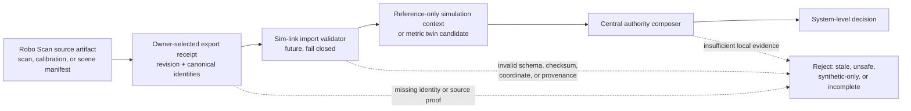

# Robo Scan Integration Boundary

## Purpose

Robo Scan is the separate repository (normally checked out beside sim-link as
`../robo-scan`) that modularizes
SceneSmith-adjacent SO-101 scene scanning, scene creation, and calibration
work. Its `environment-scanner` package (Python/CLI name `so101_scan`) owns
the upstream scan/reconstruction concepts and their local validation. Sim-link
owns the SO-101 simulation, learning, evidence, and whole-system authority
decisions.

The projects are intentionally connected by an **explicit artifact handoff**,
not by an implicit checkout, package, filesystem, or runtime dependency. The
sibling path above is a local-development convention; use the Robo Scan
repository's own `GOAL.md` and `docs/autonomous-workflow/project_state.json`
for its current state and permissions.

No automatic filesystem, package, Git, or runtime import is permitted. A
future handoff consumes an owner-selected immutable export, never whatever a
nearby checkout happens to contain.

## Integration Status

| Concern | Current boundary | Meaning |
| --- | --- | --- |
| Source ownership | Robo Scan | It owns scan, reconstruction, and calibration artifact generation. |
| Runtime dependency | None | Sim-link neither imports nor vendors `environment_scanner`/`so101_scan`. |
| Automatic artifact discovery | Prohibited | A sibling checkout, working tree, or new upstream commit never changes a sim-link scene. |
| Current physical/metric authority | None in sim-link | An upstream local capability or historical result cannot qualify this twin. |
| Future exchange | Owner-selected sealed export | Sim-link may validate one explicitly named handoff manifest under a reviewed implementation slice. |

The reviewed upstream checkout is a useful capability source, not a claim of
readiness. At review time, its reference-only layered-scene compiler requires
`metricAuthority: false`, and its current state withholds native depth,
real-capture, metric-observation, metric-reconstruction, and local-viewer
validity. Re-read the upstream state before any later implementation; this
document does not freeze, mirror, or override it.

## Authority-Preserving Handoff

The import validator and receipt shown above are a contract for a future
reviewed slice; they are not implemented runtime capability. A passing
upstream artifact can establish only the local facts that its schema and
evidence support. The central composer remains the sole path to a
system-level state.

## Artifact Classes

| Upstream class | Sim-link may use it for | It may never establish |
| --- | --- | --- |
| `reference_only` / synthetic scene manifest | visual context, scene-design hypothesis, or deterministic simulation fixture clearly labelled as such | metric scale, measured robot/world pose, camera calibration, physical-twin qualification, training readiness, physical transfer, or promotion |
| appearance or inferred reconstruction | non-authoritative visual/semantic adjunct whose provenance stays attached | measured geometry or a physical constraint |
| measured metric candidate | a *candidate* calibration/geometry input only after a future validator accepts its explicit evidence | automatic whole-system authority of any kind |
| raw observations or private source paths | nothing: they remain upstream/private and are not an exchange format | a sim-link artifact or public evidence record |

In particular, a generated MuJoCo AprilTag layout or simulation workcell is a
fixture. It is not evidence that the physical tag layout, camera intrinsics,
depth scale, hand-eye transform, or robot-base/world transform has been
measured.

## Required Future Export Receipt

Before code imports a Robo Scan artifact, a reviewed handoff schema must bind
at least these fields. The outer receipt will be signed in sim-link with its
own content-address contract after immutable upstream files are copied into a
declared artifact root; it must not rely on a mutable sibling path.

| Field family | Required binding |
| --- | --- |
| Producer identity | source repository identifier, immutable revision, package/schema version, and explicit export timestamp |
| Artifact identity | canonical manifest identity, byte SHA-256, byte count, media type, safe relative paths, and every source artifact ID in canonical order |
| Evidence classification | `measured`, `appearance`, `inferred`, or `reference_only`; source classification; privacy status; capture/reconstruction provenance |
| Coordinates | declared units, axes, handedness, frame names, and finite proper rigid transforms with directionality |
| Metric prerequisites | calibrated intrinsics/distortion/depth model, measured fiducial-layout identity and uncertainty, camera/end-effector and base/world transforms, residuals, and held-out validation evidence |
| Authority limits | local facts only, explicit negative/unknown fields, expiry/freshness rules, and no self-declared twin, transfer, promotion, or training state |

The validator must reject missing fields, non-finite values, path escape,
checksum drift, coordinate ambiguity, unmeasured geometry posed as measured,
stale evidence, source-revision mismatch, or an attempt to use a local
artifact as a system-level grant.

## Future Implementation Sequence

1. Choose one immutable Robo Scan export and record the exact revision in a
   new sim-link brief; do not read from a live checkout at runtime.
2. Add a narrow receipt schema and validator with adversarial tests for
   identity, provenance, transforms, uncertainty, and authority spoofing.
3. Admit a reference-only export only as a clearly labelled simulation
   context, or admit a metric export only as a twin *candidate*.
4. Re-run sim-link’s artifact, coordinate, and central authority contracts.
   The candidate remains non-promotable unless that independent composition
   accepts every prerequisite.
5. Record the accepted/rejected result in sim-link state, ledger, review, and
   immutable evidence. Never retroactively relabel older fixtures.

No step above opens a camera, robot, serial port, capture session, motion API,
training run, external compute, or Brev instance.

## Read Next

- [Program architecture](./architecture.md)
- [Requirements and contracts](./requirements-and-contracts.md)
- [Current versus historical guide](./current-and-historical.md)
- [Robo Scan handoff brief](./briefs/143-robo-scan-handoff-boundary.md)
