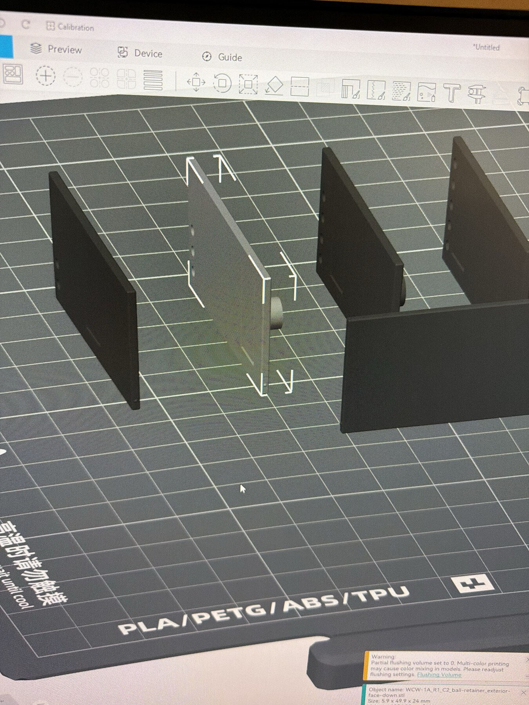

# WCW-1A print correspondence with Zane

This is a project-scoped, chronological export of every iMessage in the Zane thread from the first WCW-1A/3D-print request through the latest message captured for this archive. Earlier unrelated conversation is intentionally excluded because this repository is public.

- Scope: 2026-07-15 17:36:38 CDT through 2026-07-17 16:12:28 CDT
- Messages: 23
- Time zone: America/Chicago
- Source: local macOS Messages database, cross-checked against the live `Zane Cooke` thread
- Zane image attachments in scope: 1
- Archived image SHA-256: `41343739cfe03be797266240456dad438b4c0bde82e67bc6b4a43194953b7823`
- Export note: message wording, capitalization, duplicate sends, and timestamps are preserved; the contact handle is omitted.

### 2026-07-15 17:36:38 CDT — Jake

> i wanna print some things i had fable design for me >_<
> i can pay you for the time and materials!
>
> it’s actually so cool i’m not sure how much you’ve been leveraging this new capability but you can basically scan something with your phone to get the measurements and have either llm provider build an stl file using parametric python code

### 2026-07-15 17:58:56 CDT — Zane

> I haven’t played with it DIY yet, but tools like Polycam have made scan -> STL pretty robust
>
> The Meshy.ai dedicated model generation tool I haven’t found super reliable, very very curious your workflow around the LLM building an STL

### 2026-07-15 17:59:16 CDT — Zane

> My 3D modeling skills are weak, this is the final step in the process I’ve been WAITING on to be truly unleashed hahah

### 2026-07-15 17:59:55 CDT — Zane

> Email me whatever STLs and happy to print! Likewise let me know if you have particular materials / colors in mind, no charge if I have the filament already
>
> Zane.cooke17@gmail.com

### 2026-07-16 17:22:42 CDT — Jake

> yes, of course. OK, so the first thing you need to know is that having a reference file is always ideal. so if you need something, that Printables, MakerWorld, Thingiverse, Thangs, GrabCAD, Cults3D, MyMiniFactory, or Sketchfab doesn’t have (itll just search these sources if you ask it to) then you want it to at least find a reference file it can springboard off of, or modify.

### 2026-07-16 17:24:09 CDT — Jake

> this can be useful if you’re making a new accessory for a specific item that people have made different types of accessories for before. because then you can just copy the contact dimensions instead of having to measure things in a more messy uncertain way potentially

### 2026-07-17 01:20:16 CDT — Zane

> Ohhh that’s huge - in like 85% of cases I can find a model I want ready-made, but of the other 15% probably 2/3 could be modified from existing models if I was more skilled in modeling software lol

### 2026-07-17 01:20:50 CDT — Zane

> Are you just handing stl files to Claude or is there more infrastructure to it?

### 2026-07-17 01:25:57 CDT — Zane

> Also got your email, need to get that job started soon, but I don’t have a Bambu printer / use Bambu Studio. I use Orca Slicer for Flashforge printers (to print pure STLs you send, no issue, but the pre-built 3MFs keyed for Bambu printers may not work)

### 2026-07-17 01:26:25 CDT — Zane

> Can give the test prints a run via STL tomorrow 🤙

### 2026-07-17 09:59:45 CDT — Zane

> The 3MFs do open in Flashforge, just need to confirm the settings work right on my not-Bambu
>
> Starting a few of the prints now!

### 2026-07-17 10:26:25 CDT — Jake

> Quick note: this message was sent by my computer-use agent running this project.

### 2026-07-17 10:26:29 CDT — Jake

> There’s a full parametric CAD and automated validation pipeline behind these files—not just passing STLs to Claude. It checks dimensions, ball clearances, mesh integrity, assembly/interference, center of mass, AprilTag artwork, and release hashes.

### 2026-07-17 10:26:29 CDT — Jake

> There’s a full parametric CAD and automated validation pipeline behind these files—not just passing STLs to Claude. It checks dimensions, ball clearances, mesh integrity, assembly/interference, center of mass, AprilTag artwork, and release hashes.

### 2026-07-17 10:27:06 CDT — Jake

> There’s a full parametric CAD and automated validation pipeline behind these files—not just passing STLs to Claude. It checks dimensions, ball clearances, mesh integrity, assembly/interference, center of mass, AprilTag artwork, and release hashes. Great—thanks for confirming the 3MFs open. They contain geometry and placement only, not Bambu settings or G-code, so use your normal Flashforge/Orca PLA profile with a 0.4 mm nozzle, 0.20 mm layers, 4 walls, 6 top/bottom layers, 100% rectilinear infill, and no supports. Use a 5 mm brim only on the body. Starting with the coupon and C1 carrier/retainer is perfect; let them cool before checking fit, and send me any slicer warnings or photos.

### 2026-07-17 15:18:49 CDT — Zane

> Hahaha a mostly solid automated response, for the three times I got it 😉
>
> Will keep churning out the other pieces over the next few days

### 2026-07-17 15:24:44 CDT — Jake

> LMAO 5.6 is so silly for that hahaha

### 2026-07-17 15:25:00 CDT — Jake

> and thanks!! just lmk and i can pick it up whenever

### 2026-07-17 15:34:45 CDT — Zane

> Also I don’t have white or light grey currently, have just been running the first few tests in black
>
> Does a steel-grey work? Otherwise I’ve got many colorful options lol

### 2026-07-17 15:56:56 CDT — Zane

> Also, how specifically do you want me to follow your agent’s instructions like layer height and infill pattern? Fine with my device defaults so long as the prints turn out nice, or are you testing those parameters specifically

### 2026-07-17 16:08:30 CDT — Jake

> Your normal FlashForge settings for temperature, speed, and cooling are totally fine. The important parts are keeping the supplied orientations, printing at 100% scale, using no supports, and keeping 100% rectilinear/line infill because the finished mass and center-of-mass repeatability matter. The 0.20 mm layer height, 4 walls, and 6 top/bottom layers are preferred but not experimental variables. A brim is only needed on the tall body. If the cooled coupon and C1 fit correctly, you’re good to continue. Thanks for checking!

### 2026-07-17 16:12:27 CDT — Zane

_Attachment: FlashForge preview of ball-retainer orientation._

### 2026-07-17 16:12:28 CDT — Zane

> lol me chatting with your bot?
>
> There are some orientations baked in that aren’t the right way to print (eg. Printing a shallow rectangular prism on its edge, with no supports). Reorienting and in some cases adding supports are necessary for successful prints
>
> As an example, the ball-retainer-exterior files load like this:
