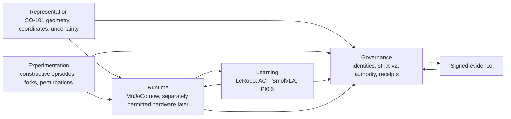
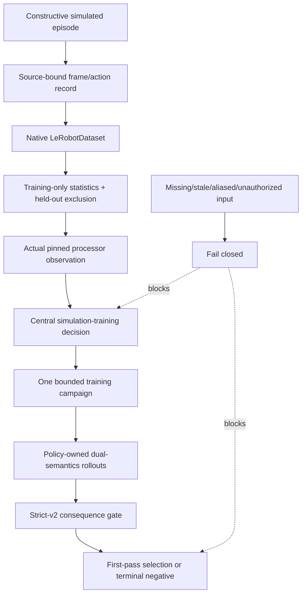

# Compressed Architecture

## Design thesis

Use established packages for policy, training, datasets, processors, motors,
teleoperation, and physics. Own only the boundaries that establish meaning and
trust: coordinates, strict task semantics, provenance, evidence identity,
authority composition, bounded runners, and producer/consumer handoffs.

The three mutable things—workcell twin, robot policy, and optional learned
dynamics—must remain separate. The current MVP updates the policy against one
explicit simulator/data contract. It does not learn residual dynamics or allow
the policy to rewrite the twin.

## Five-plane system

| Plane | Keep | Do not recreate |
| --- | --- | --- |
| Representation | SO-101 pins, coordinate bridge, structural/measurement contracts | another robot description language or hidden calibration convention |
| Experimentation | constructive strict-success source, deterministic randomization, native episodes | a general scientist service, reward compiler, or skill graph |
| Learning | pinned LeRobot policies and processors | local forks of model architectures except reviewed minimal patches |
| Runtime | MuJoCo execution and signed mirrors; bounded hardware adapter later | LLM as a real-time controller or implicit hardware access |
| Governance | canonical JSON, SHA-256, strict-v2, central composer, permits, receipts | self-promoting component artifacts or prose-only gates |

## Component boundary

### External package ownership

- **MuJoCo** owns state transitions, contacts, and rendering. It does not decide
  policy competence or physical truth.
- **LeRobot** owns policy implementations, training, datasets, and processing.
  SceneSmith observes and binds package behavior rather than reimplementing it.
- **SO-ARM100/Menagerie** own source geometry facts. Local code adds explicit
  workcell semantics but does not casually fork joint or body meaning.
- **leLab** is an optional pinned UI/URDF surface, not a second policy stack.
- **Robo Scan** is a separate producer of future metric scene/calibration
  receipts, never an implicit runtime dependency or authority source.

### Portable kernel

The manifest derives the transitive internal import closure of the current R0,
ACT, SmolVLA, evaluator, authority, and Robo Scan receipt entrypoints. The most
important owned boundaries are:

| Boundary | Primary source |
| --- | --- |
| Canonical signed artifacts | `scenesmith/robot_lab/artifact_contract.py` |
| Central decisions | `scenesmith/robot_lab/authority_composer.py` |
| Stack and patch identity | `lerobot_stack.py`, `robotics_dependency_lock.py` |
| SO-101 coordinate semantics | `so101_coordinates.py`, `so101_processor.py` |
| Truthful grasp result | `strict_grasp.py`, `gripper_contact_semantics.py` |
| R0 construction | `scripted_grasp_episode_generation.py`, `t20_42*` |
| ACT replacement | `t20_43b_r1_act_*` |
| SmolVLA baseline | `t20_44_r2_smolvla_*` |
| Quantitative evidence | `quantitative_strict_v2_receipt.py`, `paired_trace_runner.py` |
| Scan handoff | `robo_scan_export_receipt.py` |

## Data and proof flow

The decisive rule is that each arrow creates evidence for the next gate; no
earlier success implies a later one. A scripted source success is not a learned
success. A simulation learned success is not a physical qualification. A shell
permission profile is not a hardware permit.

## Action cadence contract

The current policy evaluations use action chunks of 50. Two semantics must be
reported:

- **chunk-50:** sample once, execute the whole chunk.
- **receding-10:** resample every ten actions while preserving queue/reset and
  tail accounting.

For a 244-frame episode with `n_action_steps=50`, chunk starts are frames
0/50/100/150/200 and executed lengths are 50/50/50/50/44. The six unused tail
actions are never actor-valid padding. This exact accounting prevents a common
source of misleading closed-loop evidence.

## Authority contract

Only the central composer may grant system-level states. Component outputs may
prove a local fact but cannot grant `physical_twin_qualified`,
`physical_transfer_ready`, or `promotion_eligible`. All authority is local,
bounded, content-addressed, time-scoped where needed, and non-transferable to a
new repository.
