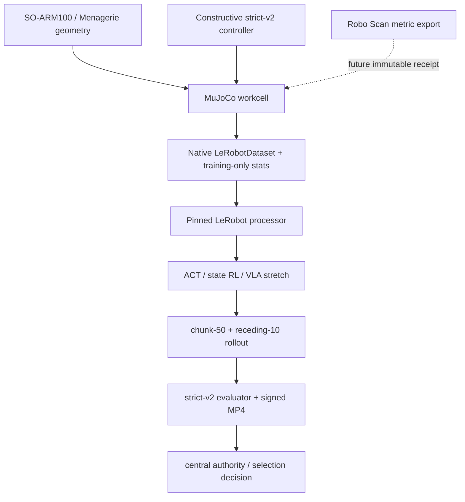
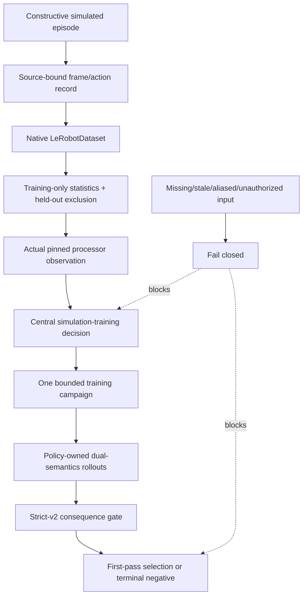
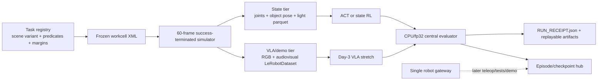

# Compressed Architecture

## Design thesis

Use established packages for policy, training, datasets, processors, motors,
teleoperation, and physics. Own only the boundaries that establish meaning and
trust: coordinates, strict task semantics, provenance, evidence identity,
authority composition, bounded runners, and producer/consumer handoffs.

The three mutable things—workcell twin, robot policy, and optional learned
dynamics—must remain separate. The current MVP updates the policy against one
explicit simulator/data contract. It does not learn residual dynamics or allow
the policy to rewrite the twin.

## Five-plane system

| Plane | Keep | Do not recreate |
| --- | --- | --- |
| Representation | SO-101 pins, coordinate bridge, structural/measurement contracts | another robot description language or hidden calibration convention |
| Experimentation | constructive strict-success source, deterministic randomization, native episodes | a general scientist service, reward compiler, or skill graph |
| Learning | pinned LeRobot ACT plus state-based RL as primary tracks; VLA interfaces retained for stretch work | parallel model ladders before one demo works |
| Runtime | MuJoCo execution and signed mirrors; bounded hardware adapter later | LLM as a real-time controller or implicit hardware access |
| Governance | canonical JSON, SHA-256, strict-v2, replayable claims, frozen held-out sets, separate evaluator ownership | self-promoting component artifacts or prose-only gates |

## Component boundary

### External package ownership

- **MuJoCo** owns state transitions, contacts, and rendering. It does not decide
  policy competence or physical truth.
- **LeRobot** owns policy implementations, training, datasets, and processing.
  SceneSmith observes and binds package behavior rather than reimplementing it.
- **SO-ARM100/Menagerie** own source geometry facts. Local code adds explicit
  workcell semantics but does not casually fork joint or body meaning.
- **leLab** supplies the pinned URDF required by the current source-proof
  dependency lock; its UI remains optional and it is not a second policy stack.
- **Robo Scan** is a separate producer of future metric scene/calibration
  receipts, never an implicit runtime dependency or authority source.

### Portable kernel

The manifest derives the transitive internal import closure of the current R0,
ACT, SmolVLA, evaluator, authority, and Robo Scan receipt entrypoints. The most
important owned boundaries are:

| Boundary | Primary source |
| --- | --- |
| Canonical signed artifacts | `scenesmith/robot_lab/artifact_contract.py` |
| Central decisions | `scenesmith/robot_lab/authority_composer.py` |
| Stack and patch identity | `lerobot_stack.py`, `robotics_dependency_lock.py` |
| SO-101 coordinate semantics | `so101_coordinates.py`, `so101_processor.py` |
| Truthful grasp result | `strict_grasp.py`, `gripper_contact_semantics.py` |
| R0 construction | `scripted_grasp_episode_generation.py`, `t20_42*` |
| ACT terminal evidence | `t20_43b_r1_act_*` |
| ACT continuation/terminal evidence | Brief 227/original T20.43c plus compact T20.43c-R2 terminal receipts and Reviewer 318 |
| ACT release localization | `f0_release_gap_diagnosis.py`, `f0a_chunk_phase_observability.py`, `f0b_hybrid_tail_cadence.py`, and the replayable F0b trace |
| SmolVLA baseline | `t20_44_r2_smolvla_*` |
| Immutable-safe current mirror | `scripts/robot_lab/render_rollout_mirror_v2.py` |
| Quantitative evidence | `quantitative_strict_v2_receipt.py`, `paired_trace_runner.py` |
| Scan handoff | `robo_scan_export_receipt.py` |

## Data and proof flow

The decisive rule is that each arrow creates evidence for the next gate; no
earlier success implies a later one. A scripted source success is not a learned
success. A simulation learned success is not a physical qualification. A shell
permission profile is not a hardware permit.

Evidence-path smoke is schema-specific. A valid render of an older trace proves
the renderer environment but not dispatch for a new trace schema. Original
T20.43c proved the immutable-safe v2 path, exact checkpoint-0 equivalence,
empty optimizer state, and an unadvanced sampler before reaching update 728.
Its later interruption was scheduling-owned and inconclusive. T20.43c-R2 then
completed the same ACT recipe and resolved the model question as a terminal
negative: chunk-50 acquired the grasp/lift/lower sequence but missed strict
release, while receding-10 was weaker. Neither consumed marker transfers or
authorizes a retry. F0 then ruled out three tempting coverage/normalization
explanations and localized release about 20 frames late. F0a exposed
lift/lower observation aliasing. F0b changed only tail cadence: it increased
strict retreat-contact persistence from 1 to 17 frames but still had both pads
in contact at release-final frame 219. This is evidence for a phase/consequence
control problem, not evidence that a scheduler or another same-recipe rung will
solve it.

## Fork-birth cut

W1 rehearses the exported source stack as it actually exists: parent/child
runtime composition and all three retained trace schemas. That proof prevents
the transfer process from hiding a missing dependency. It is not the fork's
permanent runtime design.

- The pinned LeRobot venv becomes the sole interpreter; rollout and rendering
  are in-process and subprocess dispatch is removed.
- State-first reach/push is camera-free and terminates on success within 60
  frames. Cameras and full audiovisual data belong only to the VLA/demo tier.
- Training may differ across MPS/CUDA. Evaluation runs CPU/fp32 and must produce
  bit-identical verdicts on Macs and Linux.
- ACT and state-based RL are the only primary tracks until an end-to-end demo
  works. SmolVLA and PI0.5 are stretch tracks.
- One frozen XML plus task-registry data replaces per-task scene editing.
- `RUN_RECEIPT.json` replaces source-repo ceremony only in the fork and records
  commit, config hash, dataset identity, seed, wall clock, and metrics.
- Outputs are ignored from fork commit one and use human run names. A single
  gateway is the only future robot-facing surface.

Frozen held-out scenes/seeds, replayable signed claims, and evaluator ownership
separate from training survive the simplification unchanged.

## Action cadence contract

The current policy evaluations use action chunks of 50. Two semantics must be
reported:

- **chunk-50:** sample once, execute the whole chunk.
- **receding-10:** resample every ten actions while preserving queue/reset and
  tail accounting.

For a 244-frame episode with `n_action_steps=50`, chunk starts are frames
0/50/100/150/200 and executed lengths are 50/50/50/50/44. The six unused tail
actions are never actor-valid padding. This exact accounting prevents a common
source of misleading closed-loop evidence.

F0b adds one diagnostic semantic without making it a new default: execute
chunk-50 through frame 175, discard the remaining 24 queued actions at frame
176, then re-decode every ten actions. The same checkpoint/seed stayed negative
and cleared contact only at final retreat after the object returned to desk
height. The fork preserves this trace as a falsifier; its fast lower RL rungs
instead use short, success-terminated state episodes where progress is
observable and consequences arrive inside the horizon.

## Authority contract

Only the central composer may grant system-level states. Component outputs may
prove a local fact but cannot grant `physical_twin_qualified`,
`physical_transfer_ready`, or `promotion_eligible`. All authority is local,
bounded, content-addressed, time-scoped where needed, and non-transferable to a
new repository.

The fork does not import this composer state. Copied grants, permits, markers,
and reviewer decisions are inert history. A fork `RUN_RECEIPT.json` records what
ran; it cannot qualify a physical twin or silently authorize robot access.
